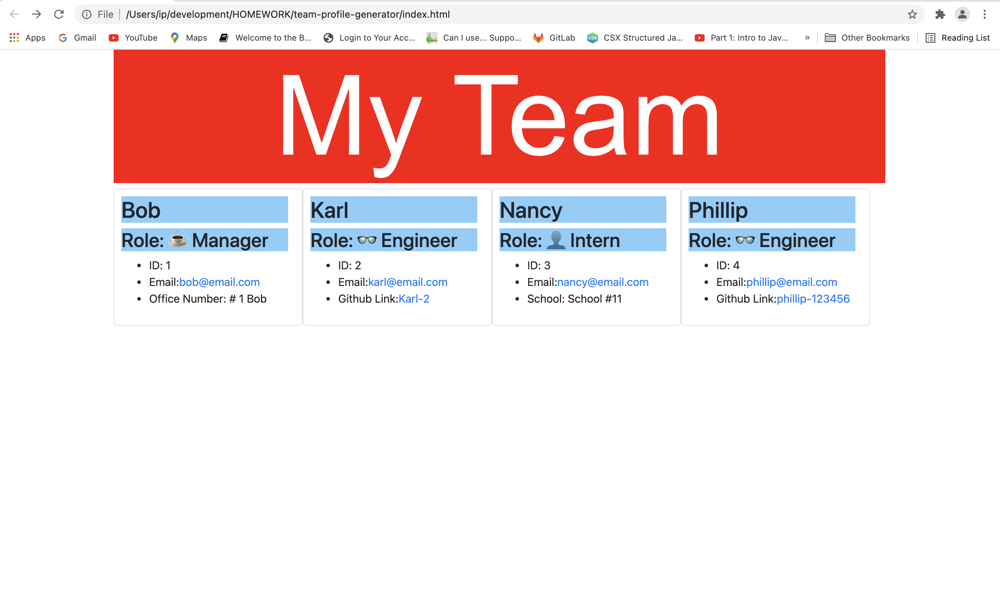

# team-profile-generator

This app is a Node.js command-line application that takes in information about employees, generates an HTML webpage and displays the summaries of the selected employees.

## Getting Started

* clone me, or fork me
* 🌎 live at: [github pages] (https://ir-p.github.io/team-profile-generator/)

* Screen shot of the deployed app: 

* [Watch the video](https://drive.google.com/file/d/1y5hO-CFNWCbHG7_mwkyrn6ikwW_Cdm1A/view?usp=sharing)
## Deployment
* just deploy, no other actions needed

## Build With 

* [inquirer] (https://www.npmjs.com/package/inquirer) - objects

## Acknowledgements
* **Billie Thompson** - *README template* - [PurpleBooth](https://github.com/PurpleBooth))

